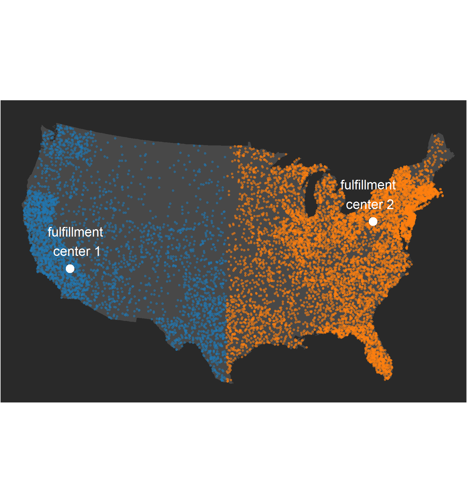

\section{Introduction}

In 2016, e-commerce sales totaled an estimated $394.9 billion, accounting for 8.1 percent of total annual sales. This total was a 15 percent increase from 2015. Advances in technology and adoption of the internet has forced the retail industry to make dramatic shifts toward e-commerce. While this presents a tremendous opportunity for business growth, the cost associated with inefficiencies in supply chains makes optimally allocating inventory to fulfillment centers integral to retailers' success. Customer retention and loyalty requires the business to deliver products quickly and efficiently, so inventory allocation to fulfillment centers must account for two primary factors:

+ item cost of delivering units from fulfillment centers to delivery addresses
+ length of time required to fulfill orders to delivery addresses from fulfillment centers

While the first of these costs can be associated with a particular dollar value, the cost related to the second consideration is driven by customer disatisfaction with delayed product arrivals and is more difficult to quantify. Additionally, there are a host of other factors to be considered when optimizing inventory allocation. These include the cost of transferring units between fulfillment centers to respond to shifts in demand, as well as decisions about whether to fulfill online orders from stores instead of dedicated fulfillment centers. In the following sections, we propose a method to determine the proper allocation of inventory to fulfillment centers. Our method assumes that no transfers are
made between fulfillment centers and that e-commerce orders are fulfilled only from dedicated fulfillment centers and no orders will be fulfilled by stores, however, potential future work could be explored by relaxing these assumptions.


\subsection{ [Typical Solution] How they work:}

There are several products on the market for supply chain optimization, and many of these are outfitted with the functionality for determining efficient allocation of inventory to distribution centers. We can decompose the common approach to optimizing inventory allocation into two primary tasks: predicting future inventory demand and then given this forecast, develop a plan to purchase and distribute products so as to meet the demands at each fulfillment center in the most cost efficient way possible.

Demand predictions are made by fitting statistical models using past demand as well as predicted future events to forecast future demand. Often, these forecasts are done using data that has been aggregated to a fairly high level, such as by week, subpopulation of customers, category of merchandise, etc, though new technical ability to store and access large amounts of data quickly allows demand forecasting to be done at a far more granular level, such as at the daily level, per item per customer. Safety stock is the extra stock kept on hand to mitigate rish of inventory depletion due to unpredictability in demand. 

The service level refers to the probability of the period-specific demand quantity exceeding the inventory quantity on hand:

\[
\mbox{service level} = Prob\left(\mbox{period demand} \le \mbox{available inventory stock}\right).
\]

Setting safety stock levels appropriately is critical to minimizing costs. Typically, the amount of safety stock is chosen so that the probability of not meeting customer demand is low, based on the predicted sales. Loss incurred due to inaccurate forecasts is due to either overestimating demand, when excess inventory is wasted or discounted, or due to underestimating demand resulting in missed sales opportunities and a potentially unsatisfactory customer experience.

After specifying the service level and obtaining a sales forecast to predict demand, retailers determine the safety stock levels and the corresponding total amount of product needed for order fulfillment. The total amount of purchased for order fulfillment is called the total buy, $b$. There is little to no uncertainty associated with which fulfillment center is most optimal for shipping a given order, so determining how to distribute inventory among fulfillment centers is a deterministic task. The center that will fulfill each online order is determined using a set of rules which specify the logic necessary for minimizing the cost of shipping orders from fulfillment centers to delivery locations and the length of time required for products to be delivered to the customer. Using these rules, the task of allocating inventory becomes a matter of straightforward bookkeeping. Our goal is not to optimize this set of rules, but instead, we  want to address the difficulty in choosing an optimal allocation presented by the uncertainty in the forecasted demand.

\subsection{Typical Solutions: Why they suck} 

Despite the numerous existing applications offering solutions to the allocation problem, inventory allocation inefficiencies are still quite prevelant across retail supply chains. The difficulty in accounting for demand forecast uncertainty is the root of the underperformance of many tools on the market. Many of these tools overly simplify this uncertainty in various ways. Many rely on rigid assumptions about the distribution of future product demand for a given fulfillment center. For example, many universally accepted methods assume that safety stock is proportional to the standard deviation of the demand, which is assumed to follow a Normal distribution. It is also common in the existing market for software solutions to assume that the demand at a given fulfillment center is independent from week to week, i.e. that the demand in the current week contains no useful information for predicting demand for the week to follow. In most practical situations, this assumption is invalid due to the innate dependency between time and demand. The classic example is the trendsetter: she purchases an item and after wearing it, the crowd follows suit and demand for a given product increases until it reaches a certain point at which the market is saturated. Invalid assumptions about the variability in demand inhibit the ability to adequately quantify the uncertainty with predicted demand. Characterizing this variability faithfully is integral to specifying the initial product buy and allocation to each fulfillment center. 

Even when all the assumptions of a forecasting model can be verified to be reasonable, there is still uncertainty associated with both future predicted demand as well as the model we use to make these predictions. Most existing inventory allocation tools determine the best initial allocation of inventory to fulfillment centers by assuming that this prediction error doesn't exist. Unfortunately, the allocation quantities inherit the uncertainty in the demand forecast used to determine these quantities. Failure to account for the uncertainty can lead to suboptimal allocation of inventory, leading to loss incurred due to fulfillment centers with overstock or inability to fulfill customer orders where the demanded exceed projections.

In the section to follow, we will provide a simple illustration of the uncertainty associated with an inventory allocation specification. We propose adjusting for this uncertainty by employing a Bayesian approach to statistical modeling which allows retailers to consider all of the _what-ifs_ when forecasting sales and allocating the corresponding appropriate inventory quantities. 

\section{Solution: skinny in 3 weeks!}

Before allocating inventory quantities to each available fulfillment center, a retailer must determine the total buy. Denote the true demand during the pre-specified time period by $d^*$. To accelerate the rate of sales of inventory that hasn't been sold after a prespecified amount of time, retailers will discount prices. When the demand does not meet the buy, i.e. $d^* < b$, there are $b - d^*$ excess units to be sold. Excess units are sold at a price resulting in a lower AUR than during the planned sales period. 

```{r echo=FALSE, fig.cap="A typical curve for describing the relationship between the price and the amount excess inventory stocked.",fig.align="center",out.width = "190px",out.height="190px"}
library(ggplot2)
library(magrittr)

data.frame(overstock=seq(0,100),
            sale_AUR=20*exp(-0.08*seq(0,100))) %>%
     ggplot(., aes(x=overstock,y=sale_AUR)) +
     geom_line() +
     theme_minimal() +
     xlab("excess quantity") +
     ylab("AUR") +
     ggtitle("Discount amount per unit retail") +
     theme(axis.text=element_blank())
```

We assume that the retailer has a pricing strategy in place and that the AUR for excess units can be expressed using some markdown function $m$. A typical choice for a function describing the relationship is displayed in Figure 1. When the demand exceeds the buy, we make $\$r$ for each of the $b$ units sold, however, a retailer relinquishes $\$r$ for every unit that they underbuy. If a retailer overbuys, then revenue is compromised because the price must be discounted to clear excess stock. For a product with an AUR of \$$r$, the total revenue is given by  

\[
\mbox{revenue} = \left\{\begin{array}{lr}
\;\;\;b r & \mbox{when demand exceeds the buy}.  \\
\underbrace{\left[ r d^* \right]}_{\substack{full\;price\\ revenue}} + \underbrace{\left[ m\left( b,d^* \right) \right]}_{\substack{discounted \\ revenue}} & \mbox{when the buy exceeds demand.}
\end{array}\right.
\]

Revenue is maximized when the buy is equal to the demand, so forecasting the total number of units sold across the entire market is critical. 

```{r,echo=FALSE, fig.align="center"}

```

The total buy is determined by the predicted total demand for the entire product market. Typically, this predicted total is constructed by breaking up the market into a set of geographic areas and adding up the predicted demand for each of these areas. The regions are designated so that they partition the market i.e. any household within the product market belongs to one and only one of the specified regions, and each region contains at least one household. For example, we might predict sales within political boundaries (\emph{e.g.,} county or state) or within designated marketing areas. Predicted demand in each region drives the division of the total buy among fulfillment centers. Orders in a given region are fulfilled by the nearest center, so as to minimize costs associated with order distribution. The cost of fulfillment center $f$ fulfilling an order to household $h$ may be expressed as the sum of three individual costs: the fixed cost of fulfilling a single order, the cost of shipping an order one unit distance, and the cost incurred each day required for the customer to receive the order.

\begin{align*}
c \left(f, h\right) &= \mbox{fixed cost} + \mbox{cost of distance traveled} + \mbox{cost of delivery time}. \\
\end{align*}


Consider a simple scenario: a retailer has two fulfillment centers available for distributing orders to locations across the continental US. The map in Figure~ shows the locations of these fulfillment centers and a sample of possible locations to which the retailer will need to ship product.

```{r,echo=FALSE, error=FALSE, warning=FALSE, message=FALSE, cache=TRUE}

load(file.path(getwd(),"..","cache","toy_HH_samples.Rdata"))
load(file.path(getwd(),"..","cache","toy_fulfill_centers_locations.RData"))

#Calculate distances from each ordering HH to each FC
  toy_deliver_distances <- as.matrix(dist(rbind(toy_fulfill_centers_locations[, c("lon", "lat")],
                                            toy_HH_samples[, c("lon", "lat")])))
  toy_deliver_distances <- toy_deliver_distances[1:length(unique(toy_fulfill_centers_locations$fc)), 
                                         -(1:length(unique(toy_fulfill_centers_locations$fc)))]
  toy_deliver_distances <- matrix(as.numeric(toy_deliver_distances),
                                  nrow = nrow(toy_fulfill_centers_locations))
  
  #Find the closest FC to each HH
  toy_closest_delivery <- apply(toy_deliver_distances, 2, which.min)
  #table(toy_closest_delivery)
```


Using fulfillment costs and strategy rules, we can calculate the monetary value $\nu$ of an initial allocation. Given the true demand in region 1, $y_1^*$, and the true demand in region 2, $y_2^*$, the value of allocation $\left(\alpha_{10},\alpha_{20}\right)$ is given by

 
\begin{align}\label{eq:allocation_value}
\begin{split}
\mbox{value of allocation} = \nu(\alpha_{10}, \alpha_{20}, y_1^*, y_2^*) &= \mbox{total revenue} \\
&- \mbox{cost of fulfilling orders in Region 1 from center 1}\\
&- \mbox{cost of fulfilling orders in Region 2 from center 2} 
\end{split}
\end{align}


An initial allocation $\left(\alpha^1_{10}, \alpha^1_{20}\right)$ having value $\nu_1$ is better than an alternative initial allocation $\left(\alpha^2_{10}, \alpha^2_{20}\right)$ having value $\nu_2$ if $\nu_1 > \nu_2$.   

## Why do we want to average over parameter values?

The calculation of $\nu_1$ and $\nu_2$  described in Equation \ref{eq:allocation_value} appears at first simple and straightforward. With a second look, however, it is apparent that not all of the prerequisites for calculation are available since the true values of future sales in each region are, of course, unavailable at the time when inventory allocation is to be determined. Naturally, we instead calculate $\nu$ by replacing the unknown true future sales with predicted future sales, and while this substitution is intuitive and simple, it introduces subtle complexity to the problem. With any statistical forecast, there is uncertainty associated with predicted future demand, and since the value of an allocation depends on this forecast, that value also inherits the uncertainty in predicted future sales. In order to effectively use the value $\nu$ to identify the optimal allocation of product, we need a way to account for this uncertainty. Bayesian methods are a class of statistical techniques that provide a natural way of accounting for uncertainty in demand prediction. To understand how this approach are different from traditional methods and what advantages they provide in this situation, we first need to understand the different sources of uncertainty in predicted demand (and thus, in our estimated value of an allocation.)

```{r,echo=FALSE, fig.align="center",out.width = "190px",out.height="190px"}

```

Imagine that I have a magic box, and on the box is a magic button and a set of dials. When the button is pressed, the box generates values of total sales in each of the two regions.  The dials allow you to specify the ``state of the market'' in each region during the time that the product will be sold; they control the specific relationship between influential factors, or _independent variables_ and total sales. For example, the box might have four dials which control how each of the seasons affect sales in each region. In certain southern regions, we might set these dials so that winter has a strong, positive impact on sales if, for instance, there is an influx of tourism during the winter months that leads to a bump in sales. In northern regions, winter weather may dampen retail activity, so we may set the dial to generate sales given that we expect, say, a 30% decrease during winter months. Imagine that on the box, there are also dials for specifying the effect of all the other relevant independent variables such as population demographics and marketing spend, as well as dials for specifying the relationship between past sales and future sales.  

```{r echo=FALSE, fig.align="center",out.width = "290px",out.height="290px"}
knitr::include_graphics("img/black-box-sales-output.png") 
```

In the context of statistical modeling, the dials control the values of the _model parameters_, $\theta_1,\theta_2,\dots, \theta_p$. We denote the collection of parameters by $\boldsymbol{\theta}$. The box, however, does not output _deterministic_ values; without changing any of the dial settings, if I press the magic button multiple times, the box will produce different output. Repeatedly pressing the button generates a set of values according to the _distribution_ of sales; values with higher frequency are more likely to occur given the conditions specified by the dials. This process of generating potential values for sales according to how likely the value is to be observed is called _sampling_ from the distribution of sales.  Figure~\ref{fig:black-box-sales-output} shows what the result of sampling  100 values from the distribution of sales might look like. 

The variability in the box's output is referred to as the _intrinsic variance_ in sales - the variability in units sold even knowing the model parameters that govern how the box produces the values. This may seem concerning, but standard statistical methods give us the tools to account for this variability. If we had the proper crystal ball that could tell us the dial settings that correspond to the true parameter values, then we can account for the uncertainty in predicted demand in our valuation of an initial allocation in the following way: suppose we have a set of initial allocations $\left(\alpha^1_{10},\alpha^1_{20}\right), \left(\alpha^2_{10},\alpha^2_{20}\right),\dots, \left(\alpha^A_{10},\alpha^A_{20}\right)$ from which we want to choose the allocation with the highest value $\nu$. In a large sample from the distribution of sales, for each number that is output, we can calculate an associated value for each allocation; this repeated calculation effectively converts the distribution of sales to a distribution of value for each allocation. One might imagine taking each number in the histogram in Figure ~ and mapping it to a $\nu$ to produce a new histogram of allocation values. From this distribution of values, we assign a single value to each allocation using the mean of this distribution. An algorithm for this sequence of calculation may be written as follows:

\begin{enumerate}
\item n <- 0
\item Press the magic button to obtain predicted demand in Region 1 and Region 2, $y_1^*$ and $y_2^*$.
\item Given $y_1^*$ and $y_2^*$, calculate 
$\nu_a^{\left(n \right)} = \nu\left(\alpha^a_{10},\alpha^a_{20},y_1^*,y_2^* \right)$ 
for each allocation in the set $\left(\alpha^a_{10},\alpha^a_{20}\right)$, $a=1,\dots, A$.
\item n <- n + 1
\item if n = N, stop
\end{enumerate}

By averaging over the $N$ samples, we assign allocation $a$ value
\[
\bar{\nu}_a = \frac{1}{N}\sum_{n=1}^N \nu_a^{\left(n\right)}.
\]

Generating a sample of allocation values in this way is known as _Monte Carlo simulation_. This procedure allows us to account for the variability in sales  that is leftover after accounting for the predictor variables, but this is not the only variability that we need to consider. Like the true values of future, in practice, the true model parameters are unknown, so we don't actually know exactly where to set the dials on the black box before outputting the sampled future values. Fortunately, statistics saves the day again because we can use past information to estimate the parameters and set the dials on the box. 


```{r,echo=FALSE, error=FALSE, warning=FALSE, message=FALSE, cache=TRUE,fig.width = 3,fig.height=3,fig.align="center"}
library(lubridate)
library(ggplot2)
library(magrittr)

coffee_sales <- data.frame(weekly_high=seq(10,100,by=0.5),
                           expected_units_sold=10 + 6*seq(10,100,by=0.5)) %>%
  transform(.,units_sold=rpois(n=length(seq(10,100,by=0.5)), expected_units_sold))
coffee_sales$units_sold[coffee_sales$weekly_high==95]<- coffee_sales$expected_units_sold[coffee_sales$weekly_high==95] +90
coffee_sales$units_sold[coffee_sales$weekly_high==75]<- coffee_sales$expected_units_sold[coffee_sales$weekly_high==75] +70
ggplot(data=coffee_sales,aes(x=weekly_high,y=units_sold)) +
  geom_point() +
  theme_minimal() +
  theme(panel.grid = element_blank(),
        panel.border = element_rect(colour="grey",fill=NA)) +
  xlab("average weekly high") +
  ylab("units sold") 

```


For example, suppose a coffee retailer has historical records of weekly weather and weekly iced coffee sales. Figure ~ shows historical weekly sales plotted versus weekly average high temperature. To infer where to place the dials specifying the relationship between sales and high temperature, one can simply fit a statistical model to the data which gives estimated parameter values and a natural starting point for deciding where to place the dials on the box to generate a sample of future sales.   

```{r,echo=FALSE, error=FALSE, warning=FALSE, message=FALSE, cache=TRUE, fig.width = 8,fig.height=3,fig.align="center"}
library(lubridate)
library(ggplot2)
library(ggthemes)
library(magrittr)

slopes <- seq(5.8,6.3,length.out=5)

fits <- sapply(slopes,function(b) {
  10+b*seq(10,100,by=0.5)
}) %>% matrix(data=.,nrow=length(seq(10,100,by=0.5))*length(slopes),
              ncol=1)
fitted_df <- data.frame(expand.grid(weekly_high=seq(10,100,by=0.5),
                                    slope=slopes),
                        predicted_sales=fits,
                        accuracy=" ")
fitted_df <- rbind(fitted_df,data.frame(expand.grid(weekly_high=seq(10,100,by=0.5),
                                                    slope=c(3,8)),
                                        predicted_sales=sapply(c(3,8),function(b) {
                                          10+b*seq(10,100,by=0.5)
                                        }) %>% matrix(data=.,nrow=length(seq(10,100,by=0.5))*2,
                                                      ncol=1),
                                        accuracy=c(rep("too small",length(seq(10,100,by=0.5))),
                                                   rep("too big",length(seq(10,100,by=0.5))))))
fitted_df$accuracy <- factor(fitted_df$accuracy,
                             levels=c("too small", " ", "too big"))


```
[TODO : Insert muted melon dials set to appropriate parameter value below each facet block, cut off the facet labels]

Imagine what visual would result if we were to hand a pen to each person in a crowd and ask them to draw a line over the historical data that best characterizes the relationship between weekly average high temperature and iced coffee sales. There are infinitely many possibilities, but some of the curves will appear to be more supported by the data than others. For each of the curves is a corresponding set of parameter values, and so the more likely the curve is to be the correct one, the more likely that particular set of parameter values corresponds to the true parameter values. 

```{r,echo=FALSE, error=FALSE, warning=FALSE, message=FALSE, cache=TRUE, out.width="490px",out.height="290px",fig.align="center"}
knitr::include_graphics("img/posterior-averaging-sketch.png")
```

The green curve fits the historical data very well, so it is very likely that those parameter values are close to the parameters that were used to generate the data. We can imagine applying the green parameter settings to the machine and hitting the magic button to several times to general a sample of sales. If we compare the historical data to the output corresponding to the green settings, we could reasonably conclude that the historical data and the new data were produced using the same settings. 

While he blue curve doesn't fit the data quite as well as the green curve, it still appears to be a reasonable fit to the historical data. If we were to reset the dials to correspond to the blue parameters, we still might conclude that it is somewhat likely that the blue parameter output and the historical data were produced using the same settings. 

The red curve has the least satisfying fit to the historical data, but examining the output of the machine set to the red parameter values suggests that it's not impossible that the historical data was created using the same dial settings. 


For each of the three curves, our evaluation of the parameter values was not simply deciding that the values were either correct or incorrect, but rather somewhere on a spectrum corresponding to the probability that those particular parameter values are the correct ones, given what we know about the historical data. In addition, there are infinitely many more curves we could have considered for candidate parameter values. Rather than choose just a single setting of the parameters to produce a sample of future sales values, a better way to obtain a sample of future sales is to allow for contributions using multiple parameter settings. Parameter values that are more likely given the historical data contribute a larger proportion to the final sample. For example, we might take seven samples with the dials set to the green parameter values, 4 samples using the blue parameter values, and 1 or 2 using the unlikely pink values. This technique of sampling over all of the parameter values in proportion to the likelihood of the parameters is a cornerstone of Bayesian modeling which allows us to account for uncertainty in statistical models that standard techniques cannot.


```{r,echo=FALSE, fig.align="center",out.width = "290px",out.height="290px"}
knitr::include_graphics("img/ggmap-hh-fc-locations.png")
```


\section{After}

* Output -> Outcome -> minimize loss -> increase ROI 