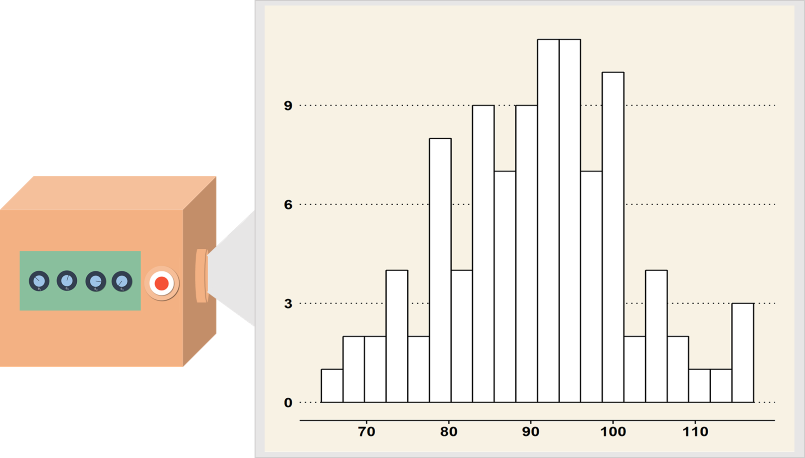
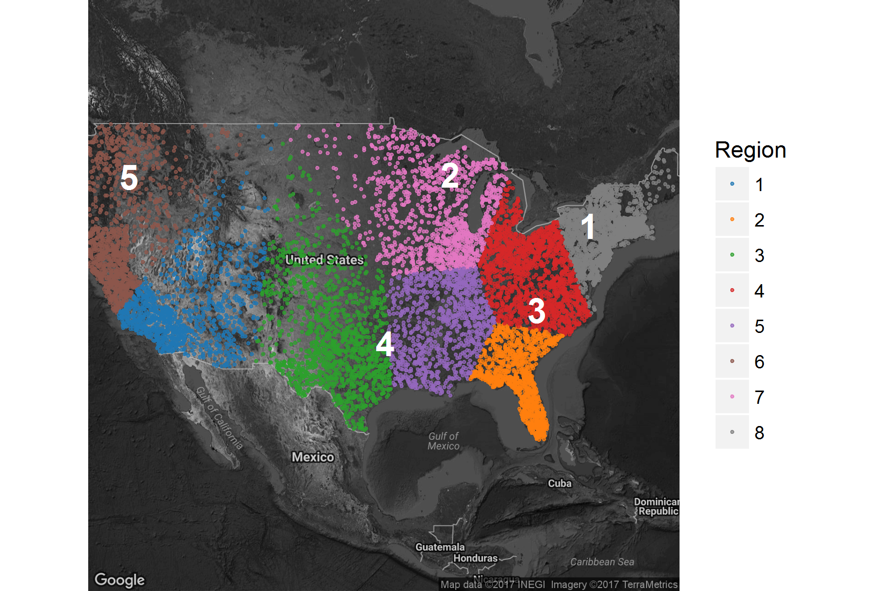

In 2016, e-commerce sales totaled an estimated $394.9 billion, accounting for 8.1 percent of total annual sales. This total was a 15 percent increase from 2015. Advances in technology and adoption of the internet have forced the retail industry to make dramatic shifts toward e-commerce. While this change presents a tremendous opportunity for business growth, the cost associated with inefficiencies in supply chains makes optimally allocating inventory to fulfillment centers integral to retailers' success. Customer retention and loyalty requires the business to deliver products quickly and efficiently, so inventory allocation to fulfillment centers must account for two primary factors:

+ item cost of delivering units from fulfillment centers to delivery addresses
+ length of time required to fulfill orders to delivery addresses from fulfillment centers

While the first of these costs can be associated with a particular dollar value, the cost related to the second consideration is driven by customer disatisfaction with delayed product arrivals and is more difficult to quantify. Additionally, there are a host of other factors to be considered when optimizing inventory allocation, including the cost of transferring units between fulfillment centers to respond to shifts in demand and the decision of whether to fulfill an order from a store instead of a fulfillment center.

In this research brief, we describe a method to determine the best allocation of inventory to fulfillment centers after a total buy has been determined.

\section{ [Typical Solutions]: How they work}

There are several products on the market for supply chain optimization. Many of those products are outfitted with the functionality for determining efficient allocation of inventory to distribution centers. These products usually perform two tasks: (1) predicting future demand and (2) developing a plan to purchase and distribute products to meet demand as efficiently as possible.

Demand predictions are made by developing statistical models based on past demand values. Often, these forecasts are done using data that has been aggregated to a fairly high level, such as by week, subpopulation of customers, or category of merchandise. After demand has been estimated, an actual buy (total inventory) is determined by adding safety stock to the estimate. Determining how this inventory is distributed is then done deterministically; the center that will fulfill each online order is determined using a set of rules which specify the logic necessary for minimizing cost.

\section{ [Typical Solutions]: Why they suck} 

Despite the numerous existing applications offering solutions to the allocation problem, inventory allocation inefficiencies are still quite prevelant across retail supply chains. The key weakness in these solutions is that they don't account for uncertainty in the demand forecast correctly due to overly rigid assumptions.  For example, it is commonly assumed that safety stock should be proportional to the standard deviation of the demand. It is also common in the existing market for software solutions to assume that the demand at a given fulfillment center is independent from week to week, i.e. that the demand in the current week contains no useful information for predicting demand for the week to follow. Both of these assumptions are invalidated by the classic example of the trendsetter - she purchases an item and after wearing it demand increases dramatically as the crowd follows her.

Even when all the assumptions of a forecasting model are reasonable, there is uncertainty in demand.  This uncertainty comes from two sources: random variation in demand and uncertainty about the model we use to make predictions. Most existing inventory allocation tools determine the best allocation of inventory assuming that this prediction error doesn't exist. This failure to account for the uncertainty can lead to suboptimal allocation of inventory, leading to loss incurred due to fulfillment centers with overstock or inability to fulfill customer orders where the demanded exceed projections.

\section{[Solution]: Skinny in 6 weeks!}

Optimizing inventory allocation is not a new concern for retailers, so it's interesting that there is so little variety in available solutions.  Futhermore, most of the existing products providing solutions to these problems aren't leveraging Bayesian methods.  Bayesian methods are a set of statistical techniques that naturally account for all of the uncertainty in a forecast, so they are a natural fit for the problem at hand.

As with all inventory allocation software, we begin by determining the total buy.  To determine the buy, we take the following steps:

1. Quantify our prior knowledge about the process generating demand.  Specifying prior knowledge is a requirement for Bayesian modeling with several advantages and disadvantages relative to classical modeling techniques.
2. Fit the model to historical data.
3. Pick a total buy that guarantees a particular service level (i.e., probability that the demand will not exceed the buy).

It's important to recognize that overbuying and underbuying are not equally bad.  When demand exceeds the buy, the retailer misses out on possible sales.  When the opposite happens, the retailer must mark down prices to accelerate the rate of sales, so excess units are sold at a price resulting in a lower AUR than during the planned sales period. Figure 1 shows a typical relationship between excess quantity and AUR - for greater excess, more markdown is required, resulting in a lower AUR.

```{r echo=FALSE, fig.cap="A typical curve for describing the relationship between the price of excess units and the overstock quantity - the amount by which the buy exceeds demand.",fig.align="center",out.width = "190px",out.height="190px"}
library(ggplot2)
library(magrittr)

data.frame(overstock=seq(0,100),
            sale_AUR=20*exp(-0.08*seq(0,100))) %>%
     ggplot(., aes(x=overstock,y=sale_AUR)) +
     geom_line() +
     theme_minimal() +
     xlab("Excess quantity") +
     ylab("AUR") +
     ggtitle("Discount amount per unit retail") +
     theme(axis.text=element_blank())
```

Based on this relationship between the buy, demand, and markdown, we can describe revenue for different scenarios.  When the buy is less than demand, total revenue is the buy times AUR.  When the buy is more than demand, total revenue is demand times (full-price) AUR plus some function of the excess buy and required markdown.  In reality, we don't know what the demand will be, so there is uncertainty about which of these scenarios will play out for a particular product.

Typically, demand is modeled and predicted separately in different regions  Then, predicted total demand is calculated by adding up the predicted demand for each of the individual regions. For example, we might predict sales within political boundaries (\emph{e.g.,} county or state) or within designated marketing areas.

Predicted demand in each region drives allocation of the total buy among fulfillment centers.  However, there is not a straightforward relationship between the two.  Because the ultimate goal is to fulfill all orders with minimal cost, fulfillment centers may serve multiple regions or just part of a region.  In general, the cost of fulfilling an order from a fulfillment center is the sum of three individual costs: the fixed cost of fulfilling the single order, the cost of shipping the order different distances, and the cost incurred each day required for the customer to receive the order.

Consider a simple scenario: a retailer has two fulfillment centers available for distributing orders to locations across the continental US. The map in Figure 2 shows the locations of these fulfillment centers and a sample of possible locations to which the retailer will need to ship product.  In this figure, color shows the region (east or west) at which demand was forecasted, which may not be the same as the regions served most efficiently by the two fulfillment centers.

```{r,echo=FALSE, error=FALSE, warning=FALSE, message=FALSE, cache=TRUE}

load(file.path(getwd(),"..","cache","toy_HH_samples.Rdata"))
load(file.path(getwd(),"..","cache","toy_fulfill_centers_locations.RData"))

#Calculate distances from each ordering HH to each FC
  toy_deliver_distances <- as.matrix(dist(rbind(toy_fulfill_centers_locations[, c("lon", "lat")],
                                            toy_HH_samples[, c("lon", "lat")])))
  toy_deliver_distances <- toy_deliver_distances[1:length(unique(toy_fulfill_centers_locations$fc)), 
                                         -(1:length(unique(toy_fulfill_centers_locations$fc)))]
  toy_deliver_distances <- matrix(as.numeric(toy_deliver_distances),
                                  nrow = nrow(toy_fulfill_centers_locations))
  
  #Find the closest FC to each HH
  toy_closest_delivery <- apply(toy_deliver_distances, 2, which.min)
  #table(toy_closest_delivery)
```

As an initial thought experiment, let's suppose we know exactly which households are going to order our product (and, by extension, exactly what demand will be).  In addition, we know all of the rules we get to set about our business: what the AUR is before markdowns (approximately, since we set price), the discounting that will be applied to excess inventory, the rules for determining which fulfillment center will fulfill orders from each address, and the costs associated with fulfilling an order from each fulfillment center.  Having all this information, we can calculate how good a particular allocation of units to fulfillment centers is.  We call this the \emph{value} of an allocation  As a simple example, let's say we allocate all the inventory to fulfillment center 1.  The value of this allocation is the revenue (average AUR times demand) minus the sum of delivery costs to households from fulfillment center 1.  We can calculate this value for any allocation, so we can find the optimal allocation via any of several standard optimization algorithms.

Things get more complex once we incorporate the various sources of uncertainty.  Even if we knew exact demand, we would have uncertainty about which households would place orders.  On top of that, we have uncertainty about what the exact demand will be from the two sources described earlier: uncertainty about our model and uncertainty about random forces influencing actual demand.

\subsection{Why do we want to average over parameter values?}

There is a statistical paradigm, Bayesian statistics, that provides a natural way of accounting for all the sources of uncertainty in demand prediction. To understand how this approach is different from traditional methods and what advantages it providse in this situation, we first need to understand the different sources of uncertainty in predicted demand (and, thus, in our estimated value of an allocation).

As an analogy, imagine that I have a magic box with a button and a set of dials. When the button is pressed, the box generates values of (potential) total sales in each of the two regions.  The dials allow you to specify the ``state of the market'' in each region during the time that the product will be sold; they control the specific relationship between influential factors and total sales. For example, the box might have four dials which control how each of the seasons affect sales. Imagine that on the box there are also dials for specifying the effect of all the other influential factors, such as population demographics and marketing spend, as well as dials for specifying the relationship between past sales and future sales.  

```{r echo=FALSE, fig.align="center",out.width = "290px",out.height="290px",fig.cap="A lovely magical box."}
 
```

In the context of statistical modeling, the dials control the values of the _model parameters_.  Setting these dials a particular way doesn't guarantee a specific demand outcome - if I press the magic button multiple times, the box will produce different output.  Some of these outcomes (the ones in line with historical trends) are more likely to be generated than others, but we can't predict exactly what we'll get.  Figure~\ref{fig:black-box-sales-output} shows what the result of pressing the button 100 times might look like. 

Let's imagine that we know exactly where the dials should be set; we know the true values of the _model parameters_.  We still don't know the optimal allocation since there is uncertainty in true demand and in where that demand will come from, so we can't calculate the value of any single allocation.  To get around this problem, use the following procedure:

1. Pick an allocation (\emph{e.g.}, all units sent to fulfillment center 1)
2. Generate a bunch of potential outcomes by pushing the magic button, say, 1000 times
3. Calculate the value of the allocation under each of those potential outcomes
4. Average those calculated values.

We can do this for lots of different allocations and see which one returns the highest average value.  Generating a sample of allocation values in this way is known as _Monte Carlo simulation_, and it allows us to account for the variability in sales leftover after accounting for the predictor variables. 

At this point, we've accounted for uncertainty in the demand when we know where the dials (\emph{i.e.}, parameter values) should be set.  Now, we need to account for our uncertainty about the model itself (\emph{i.e.}, our uncertainty about parameter values).

```{r,echo=FALSE, error=FALSE, warning=FALSE, message=FALSE, cache=TRUE,fig.width = 3,fig.height=3,fig.align="center"}
library(lubridate)
library(ggplot2)
library(magrittr)

coffee_sales <- data.frame(weekly_high=seq(10,100,by=0.5),
                           expected_units_sold=10 + 6*seq(10,100,by=0.5)) %>%
  transform(.,units_sold=rnbinom(n=length(seq(10,100,by=0.5)), mu = expected_units_sold,
                                 size = 50))
coffee_sales$units_sold[coffee_sales$weekly_high==95]<- coffee_sales$expected_units_sold[coffee_sales$weekly_high==95] +90
coffee_sales$units_sold[coffee_sales$weekly_high==75]<- coffee_sales$expected_units_sold[coffee_sales$weekly_high==75] +70
ggplot(data=coffee_sales,aes(x=weekly_high,y=units_sold)) +
  geom_point() +
  theme_minimal() +
  theme(panel.grid = element_blank(),
        panel.border = element_rect(colour="grey",fill=NA)) +
  xlab("average weekly high") +
  ylab("units sold") 

```

As an example, suppose a coffee retailer has records of weekly weather and the number of iced coffee units sold per week. Figure X displays the relationship between historical weekly sales and the weekly average high temperature. By fitting a statistical model to the historical data, we can infer how to set the dial controlling the relationship between weekly high temperature and sales. 

```{r,echo=FALSE, error=FALSE, warning=FALSE, message=FALSE, cache=TRUE, fig.width = 8,fig.height=3,fig.align="center"}
library(lubridate)
library(ggplot2)
library(ggthemes)
library(magrittr)

slopes <- seq(5.8,6.3,length.out=5)

fits <- sapply(slopes,function(b) {
  10+b*seq(10,100,by=0.5)
}) %>% matrix(data=.,nrow=length(seq(10,100,by=0.5))*length(slopes),
              ncol=1)
fitted_df <- data.frame(expand.grid(weekly_high=seq(10,100,by=0.5),
                                    slope=slopes),
                        predicted_sales=fits,
                        accuracy=" ")
fitted_df <- rbind(fitted_df,data.frame(expand.grid(weekly_high=seq(10,100,by=0.5),
                                                    slope=c(3,8)),
                                        predicted_sales=sapply(c(3,8),function(b) {
                                          10+b*seq(10,100,by=0.5)
                                        }) %>% matrix(data=.,nrow=length(seq(10,100,by=0.5))*2,
                                                      ncol=1),
                                        accuracy=c(rep("too small",length(seq(10,100,by=0.5))),
                                                   rep("too big",length(seq(10,100,by=0.5))))))
fitted_df$accuracy <- factor(fitted_df$accuracy,
                             levels=c("too small", " ", "too big"))

ggplot(data=coffee_sales,
       aes(x=weekly_high,
           y=units_sold)) +
  geom_point(alpha=0.6) +
  theme_minimal() +
  facet_wrap(~accuracy,nrow=1,
             strip.position = "bottom") +
  geom_line(data=fitted_df,
            aes(x=weekly_high,
                y=predicted_sales,
                colour=slope,
                group=slope),
            inherit.aes = FALSE) +
  guides(colour="none") +
  xlab("average weekly high") +
  ylab("units sold") +
  scale_color_continuous_tableau() +
  theme(panel.grid.minor=element_blank(),
        panel.grid.major = element_blank(),
        panel.border = element_rect(colour="grey",fill=NA),
        axis.text.x = element_blank())

```
[TODO : Insert muted melon dials set to appropriate parameter value below each facet block, cut off the facet labels]

Figure X shows how adjusting the dial changes our description of the relationship between sales and temperature.  Some curves appear to be more supported by the data than others. The curves in the middle panel fit the historical data very well, so it is very likely that those settings of the dial are right. The setting generating the line on the left is very unlikely, and the setting generating the line on the right is unlikely but plausible.

We could produce many more lines that fit the data with different levels of plausibility, so how do I choose just one specification of the dials to obtain a sample of demand values? Bayesian methods give us a natural way to do this. Fitting a Bayesian model provides us with information on how plausible each setting of the dial is. Instead of selecting just one setting of the dial, we can account for our uncertainty by trying lots of different settings, with the more plausible ones getting more weight.  This idea is the cornerstone of Bayesian forecasting - we sample future sales setting the dial to differrent values in proportion to how likely that setting is the correct one.  By taking into consideration every ``what-if'' case, we can account for prediction uncertainty that standard statistical approaches cannot.

```{r,echo=FALSE, fig.align="center",out.width = "290px",out.height="290px"}

```

\section{After}

* Output -> Outcome -> minimize loss -> increase ROI 